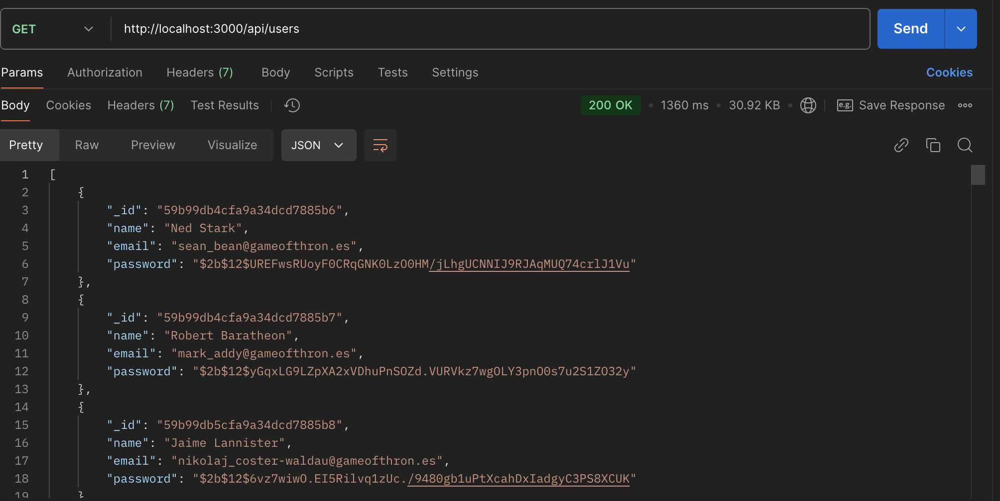

# MongoDB REST API with Node.js and Express

This project demonstrates a simple REST API built with **Node.js** and **Express**, integrated with a **MongoDB** database. The API allows you to perform CRUD (Create, Read, Update, Delete) operations on a `users` collection.

---

## Features

- **Create** new user records.
- **Read** all user records or a specific user by ID.
- **Update** existing user records.
- **Delete** user records by ID.

---

## Prerequisites

Make sure you have the following installed:

- [Node.js](https://nodejs.org/) (v14 or higher)
- [MongoDB Atlas](https://www.mongodb.com/atlas/database) account or local MongoDB instance.

---

## Installation

##### **Clone the repository:**

```bash
git clone https://github.com/dsudi1113/node-mongo-rest-api.git
cd node-mongo-rest-api
```

##### Install dependencies:

```bash
   npm install
```

##### Set up your MongoDB connection string:

Update the uri variable in routes/users.js with your MongoDB connection string:

```javascript
const uri = "your-mongodb-connection-string";
```

##### Usage

1. Start the server:

```bash
node app.js
```

2. The API will run on `http://localhost:3000` by default.
3. Use tools like **Postman**, **cURL**, or a browser to interact with the API.”

##### API Endpoints

###### * Get All Users

Endpoint: GET /api/users
Description: Retrieves all users in the collection.



###### * Create a New User

Endpoint: POST /api/users
Description: Adds a new user to the collection.
Request Body (JSON):

```json

{
    "name": "Test User 123",
    "email": "testuser@gmail.coopm",
    "password": "$2b$12$UREFwsRUoyF0CRqGNK0LzO0HM/jLhgUCNNIJ9RJAqMUQ74crlJ1Vu"
}
```


Check Mongo DB collection with the name


###### * Update a User

Endpoint: PUT /api/users/:id
Description: Updates an existing user.
Request Body (JSON):

```json

{
  
    "name": "Test user 123 - updateTest" // can be email or password field updates too
  
}
```


Updated collection in Mongo DB


###### * Delete a User

Endpoint: DELETE /api/users/:id
Description: Deletes a user by ID.

We will use the id field to to delete user


Mongo DB collection entry is deleted

### Project Structure

```bash

node-mongo-rest-api/
├── app.js              # Entry point for the application
├── routes/
│   └── users.js        # API routes for user operations
├── package.json        # Project metadata and dependencies
├── README.md           # Documentation

```

### **Dependencies**

Express: Web framework for Node.js

MongoDB Driver: For interacting with MongoDB

Install these dependencies using:

```bash
npm install express mongodb
```

### Notes

Ensure the MongoDB connection string is correct for your setup.

For production use, store sensitive data (like connection strings) in environment variables.
License
This project is licensed under the MIT License. See the LICENSE file for details.

### Contributing

Contributions are welcome! Please open an issue or submit a pull request.
